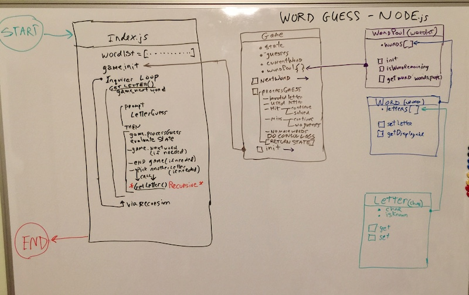

# Word-Guess-Node - Leveraging TypeScript

## Node version of Presidential themed name guess game

## Description

This node.js app has command line interface for playing a hangman style game using the US President names as a word set.

The game format is 

1.  User is presented with a random presidential name to guess showing letters as underscores initially
2.  User guess letter via keyboard - results reveiled
    1. letter not in name
    2. letter in name - underscores replaced with letter
    3. letter already used - list of previsouly used letters shown
    4. letter in name and solved the word - message followed by next word
    5. repeat above until pool of presidential names exhausted.  (if time permits allow replay of the whole set of names)

## Object Model

## User Stories / Use Cases

1.  user starts bash session

2.  user begins with node word-guess-node.js - programs begins in terminal
    1. displays 'Welcome to Word Guess - US Presidential Edition'
    2. displays 'Solve each of the 44 president name puzzles, use keyboard A through Z'
    3. displays 'You lose the puzzle if you accumlate 6 miss quesses, lets begin'
    4. displays the 'word is:   - - - - -    -    - - - -'  (for GEORGE W BUSH)
    5. displays the word in format of with underscores
        1. for readibilty:  2 spaces between each letter and 4 spaces between each name or initial
    6. 'Type letter a though z'

3.  user types non A through Z key
    1. display - "you typed '<key>' 'a' through 'z' only please"
    2. user can type again
  
4.  user types letter already used
    1. display - "you already used '<key>'"
    2. user can type again

5.  user types new letter that is not in puzzle and guesses remain
    1.  display 'Letter <key> is a miss, n guesses remaining'
    2.  user can type again

6.  user types new letter that is not in puzzle no remaining guesses
    1.  display 'Letter <key> is a miss, no remainig guesses'
    2.  display 'Solution is: G E O R G E    W    B U S H'
    3.  display 'Next Word'
    4.  displays the 'word is:   _ _ _ _    _ _ _ _ _ _ _'  (for B I L L    C L I N T O N)

7.  user types new letter that is in the puzzle but doesn't solve puzzle yet
    1.  display 'Letter <key> is a hit.
    2.  display 'word is:  G _ _ _ G _    _    _ _ _ _"  (for G in George W Bush)

8.  user types new letter that solves puzzle
    1.  display 'Solved, word is G E O R G E    W    B U S H'
    2.  display 'Next Word'
    4.  displays the 'word is:   _ _ _ _    _ _ _ _ _ _ _'  (for B I L L    C L I N T O N)

9.  user losses or solves last puzzle
    1. display 'Nice Game - you got X of 44 correct'
    2. *** if coding time permits allow for prompt to Play Again)
        1. this would re-randomize the word pool and start new game

      

### Psuedo Code - details TBD

1. Global
    1. Variables
       1. word list array - gets passed to game object for use in wordpool
2. Functions
       1. playLetter()  - recursive function played once per user input/letter
  
2. Objects/Classes
    1. letter
        1. Properties
            1. letter - a single character holding A thru Z
            2. isGuessed  - boolean state of letter
        2. Methods
            1. getLetter - returns letter character or mask
            2. setLetter - checks parameter character against letter and set isGuessed to
            true if a match
    2. word
        1. Properties
            1. word - string containing the word
            2. letters - array of letter objects for the word
        2. Methods
            1. init - constuctor function that builds letter array
            2. updateWord - take user letter guess and calls setLetter for each letter array entry 
            3. getWord - returns terminal ready word string - has masks and spacing for readibility
            4. solveWord - used when player exhausts guesses
    3. word pool
        1. Properties
            1. words - array of Word objects
        2. Methods
            1. init - used in constructor - takes array of word strings and intializes word array 
               loads words randomly so each time game played order is different
            2. isWordRemaining - boolean whether any words are available
            3. getWord - pops word object off of the words array, returns it, deletes it 
            4. showWords - diagnostic console log of the words
    4. game
        1. Properties
            1. guesses
            2. word pool
            3. current word
            4. words won/lost
        2. Methods
            1. init - build word pool and get first word
            2. process Guess - core logic for evaluating the letter guess
    3. app  - main program flow
        1. function
          
            1. playLetter()  - recursive function played once per user input/letter
            
            

#
